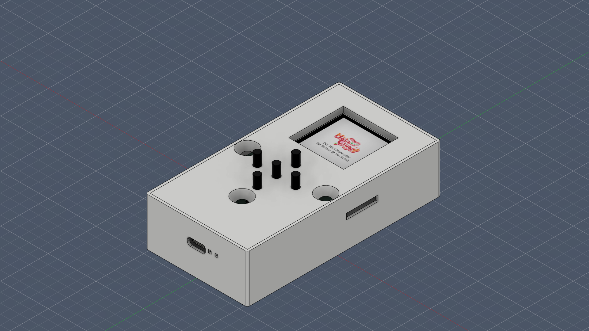
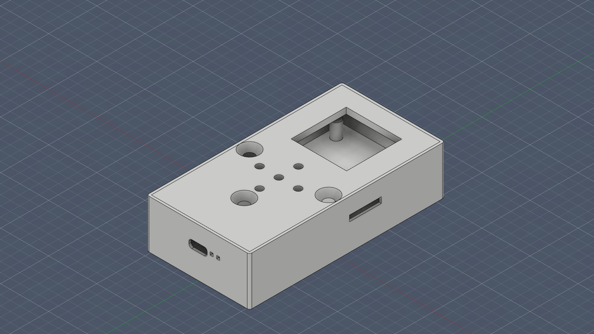

# DIY_Mini_Marauder

## The Poster
*still in the making*

## The Design
### The PCB

### The Schematics

### The Enclosure Case 
With the device inside:

Empty:

## Assembly
### Step Files
All of the step files can be downloaded [here](./Step_Files/).

### Assembly video
(to be uploaded using github's MD editor)

## Firmware
### Fzee flasher
(To try)

## Buttons and leds
### The two LEDs
Next to the USB-C port there are 2 LEDs:  
- The white one indicates wether the device is powered or not.  
- The blue one indicates wether the device is recieved power from the USB-C port or not (which is used to charge the battery).

### The two buttons on the back of the device and their functions
- The Upper button is used to put the ESP32 into the bootloader mode (AKA. the BOOT button).  
- The lower button is used to reset the device (AKA. the RST button). 

### The side switch
- The side switch is used to power the device ON or OFF.

## BOM
### BOM table (components only)
|Name                            |Value                       |Link                                                                                                                                                                                                                                                                                                                                                                    |Cost (EGP) per one|Cost (USD)|Total Cost (EGP)                           |Total Cost (USD)|Qty of packages|Description          |quantiy per pack|
|--------------------------------|----------------------------|------------------------------------------------------------------------------------------------------------------------------------------------------------------------------------------------------------------------------------------------------------------------------------------------------------------------------------------------------------------------|------------------|----------|-------------------------------------------|----------------|---------------|---------------------|----------------|
|Capacitor                       |100nF                       |https://lampatronics.com/product/smd-multilayer-ceramic-capacitor-0805-2012-104-100nf-50v-1pcs-2                                                                                                                                                                                                                                                                        | EGP 1.00         | $0.02    | EGP 3.00                                  | $0.06          |3              |                     |1               |
|Capacitor                       |4.7uF                       |https://lampatronics.com/product/smd-multilayer-ceramic-capacitor-1206-4-7uf-16v-1pcs                                                                                                                                                                                                                                                                                   | EGP 1.50         | $0.03    | EGP 4.50                                  | $0.09          |3              |                     |1               |
|Capacitor                       |2.2uF                       |https://lampatronics.com/product/smd-multilayer-ceramic-capacitor-0805-2-2uf-50v-1pcs                                                                                                                                                                                                                                                                                   | EGP 1.00         | $0.02    | EGP 1.00                                  | $0.02          |1              |                     |1               |
|SD Card slot                    |TF-115                      |https://lampatronics.com/product/push-push-type-tf-micro-sd-card-socket-adapter-automatic-pcb-connector                                                                                                                                                                                                                                                                 | EGP 8.00         | $0.15    | EGP 8.00                                  | $0.15          |1              |                     |1               |
|Charging LED                    |SZYY0603Y                   |https://lampatronics.com/product/smd-led-0805-blue-10pcs                                                                                                                                                                                                                                                                                                                | EGP 8.00         | $0.15    | EGP 8.00                                  | $0.15          |1              |Charge LED (RED)     |10              |
|Power LED                       |SZYY0603Y                   |https://lampatronics.com/product/smd-led-0805-white-10pcs                                                                                                                                                                                                                                                                                                               | EGP 8.00         | $0.15    | EGP 8.00                                  | $0.15          |1              |Power LED (White)    |10              |
|Schottky Diode                  |MBR120LSF (alt: 1N5819 SS14)|https://uge-one.com/product/smd-schottky-diode-1n5819-ss14-1a-40v-sma-package/                                                                                                                                                                                                                                                                                          | EGP 2.50         | $0.05    | EGP 2.50                                  | $0.05          |1              |Schottky             |1               |
|JST Connector                   |S2B-PH-SM4-TB               |https://uge-one.com/product/jst-connector-male-polarized-xh2-54-2p/                                                                                                                                                                                                                                                                                                     | EGP 1.14         | $0.02    | EGP 1.14                                  | $0.02          |1              |JST connector        |1               |
|BOOT and RESET transistors      |S8050                       |https://lampatronics.com/product/s8050-transistor-40v-0-5a-npn                                                                                                                                                                                                                                                                                                          | EGP 0.50         | $0.01    | EGP 1.00                                  | $0.02          |2              |RST&BOOT transistors |1               |
|Power management and TFT LED PWM|AO3401                      |https://uge-one.com/product/ao3401-sot23-general-purpose-p-channel-mosfet-smd-transistor-sot-23/                                                                                                                                                                                                                                                                        | EGP 3.00         | $0.06    | EGP 6.00                                  | $0.12          |2              |Power manage, TFT LED|1               |
|Resistor                        |5.1k                        |https://uge-one.com/product/smd-chip-resistor-size-0603-5-1k-ohm/                                                                                                                                                                                                                                                                                                       | EGP 0.50         | $0.01    | EGP 1.00                                  | $0.02          |2              |USB-C resistors 5.1k |1               |
|Resistor                        |10K                         |https://lampatronics.com/product/smd-resistor-10kohm-103-0805-10pcs                                                                                                                                                                                                                                                                                                     | EGP 2.00         | $0.04    | EGP 4.00                                  | $0.08          |2              |                     |10              |
|Resistor                        |1K                          |https://lampatronics.com/product/smd-resistor-1kohm-102-0805-10pcs                                                                                                                                                                                                                                                                                                      | EGP 2.00         | $0.04    | EGP 2.00                                  | $0.04          |1              |                     |10              |
|Prog Resistor                   |2K                          |https://lampatronics.com/product/smd-resistor-2kohm-202-0805-10pcs                                                                                                                                                                                                                                                                                                      | EGP 2.00         | $0.04    | EGP 2.00                                  | $0.04          |1              |                     |10              |
|RST and BOOT buttons            |SW_Omron_B3FS               |https://lampatronics.com/product/smd-push-button-3425mm-tactile-tact-micro-switch-momentary-4pin                                                                                                                                                                                                                                                                        | EGP 3.00         | $0.06    | EGP 6.00                                  | $0.12          |2              |                     |1               |
|LDO Enable Switch               |K3-1296S-E1_C128955         |https://uge-one.com/product/horizontal-small-slide-toggle-switch-spdt-3pin-2mm-pin-spacing-sk12d02vg7/                                                                                                                                                                                                                                                                  | EGP 4.00         | $0.08    | EGP 4.00                                  | $0.08          |1              |Power slide switch   |1               |
|directional buttons             |                            |https://lampatronics.com/product/push-button-4pin-long-6x6x13mm                                                                                                                                                                                                                                                                                                         | EGP 1.50         | $0.03    | EGP 7.50                                  | $0.14          |5              |Directional switch   |1               |
|MCU                             |ESP32-WROOM-32              |https://uge-one.com/product/espressif-esp32-wroom-32-dual-core-wi-fi-bluetooth-iot-module/                                                                                                                                                                                                                                                                              | EGP 290.00       | $5.58    | EGP 290.00                                | $5.58          |1              |MCU                  |1               |
|Battery charger                 |MCP73831T-2ACI_OT           |[Long Aliexpress link](https://ar.aliexpress.com/item/32844180448.html?spm=a2g0o.productlist.main.1.3ce63cd6piQzMy&algo_pvid=c4aa9c81-0eb9-4713-ae7a-3ae3d38d7e01&pdp_ext_f=%7B%22order%22%3A%22167%22%2C%22spu_best_type%22%3A%22price%22%2C%22eval%22%3A%221%22%2C%22fromPage%22%3A%22search%22%7D&utparam-url=scene%3Asearch%7Cquery_from%3A%7Cx_object_id%3A32844180448%7C_p_origin_prod%3A)| N/A              | $4.28    | N/A                                       | $4.28          |1              |Battery Charger      |10              |
|Programmer                      |CP2104                      |[Long Aliexpress link](https://ar.aliexpress.com/item/1005012309258723.html?pdp_ext_f=%7B%22sku_id%22%3A%2212000058021215527%22%7D&sourceType=1&spm=a2g0o.wish-manage-home.0.0&gatewayAdapt=glo2ara)                                                                                                                                                                    | N/A              | $1.97    | N/A                                       | $1.97          |1              |USB to TTL chip      |1               |
|LDO Regulator                   |MIC5219-3.3YM5              |[Long Aliexpress link](https://ar.aliexpress.com/item/1005006130724980.html?spm=a2g0o.productlist.main.6.4c73EOI6EOI6w7&algo_pvid=ba305fa5-d1fa-45ea-b339-9e0b52087c6d&pdp_ext_f=%7B%22order%22%3A%2222%22%2C%22eval%22%3A%221%22%2C%22fromPage%22%3A%22search%22%7D&utparam-url=scene%3Asearch%7Cquery_from%3A%7Cx_object_id%3A1005006130724980%7C_p_origin_prod%3A)   | N/A              | $4.23    | N/A                                       | $4.23          |1              |LDO regulator        |10              |
|Display                         |TFT_1.44                    |[Long Aliexpress link](https://ar.aliexpress.com/item/1005001598020071.html?spm=a2g0o.order_list.order_list_main.5.714d1802IvCG36&gatewayAdapt=glo2ara)                                                                                                                                                                                                                 | N/A              | $2.16    | N/A                                       | $2.16          |1              |                     |1               |
|USB-C                           |USB_C_Receptacle_USB2.0_16P |https://www.ram-e-shop.com/shop/usb9-c-type-pcb-usb-connector-on-pcb-c-type-type-female-16-pin-sku-usb9-8125                                                                                                                                                                                                                                                            | EGP 5.00         | $0.10    | EGP 5.00                                  | $0.10          |1              |                     |1               |
|Battery                         |700 mah                     |https://lampatronics.com/product/battery-polymer-3-7v-700mah-li-ion-single-cell-35x20x5mm-502035                                                                                                                                                                                                                                                                        | EGP 135.00       | $2.60    | EGP 135.00                                | $2.60          |1              |                     |1               |
|M5 Screws                       |M5*16mm                     |https://store.fut-electronics.com/products/screw-m5x16mm-hexagonal-head?_pos=15&_sid=376b1bf88&_ss=r                                                                                                                                                                                                                                                                    | EGP 2.00         | $0.04    | EGP 2.00                                  | $0.04          |1              |                     |1               |
|                                |                            |                                                                                                                                                                                                                                                                                                                                                                        |                  |          |                                           |                |               |                     |                |
|                                |                            |                                                                                                                                                                                                                                                                                                                                                                        |                  |          | EGP 501.64                                | $22.29         |               |                     |                |
|                                |                            |                                                                                                                                                                                                                                                                                                                                                                        |                  |          | (Stuff from aliexpress not included here) |                |               |                     |                |

### Orders from different manufacturers
#### In Egypt
to be finished
#### Out of Egypt
to be finished
 
 
 
 
> The firmware is designed by [JustCallMeKoko](https://github.com/justcallmekoko).  
The PCB that was reverse engineered for the making of [DIY Mini Marauder](https://github.com/mkhairyx/DIY_Mini_Marauder) is designed by [JustCallMeKoko](https://github.com/justcallmekoko).  
This repo and all of it's contents were Designed by [@mkhairyx](https://github.com/mkhairyx). 
Supported by [Fallout](https://fallout.hackclub.com/) and [Hack Club](https://hackclub.com). 

